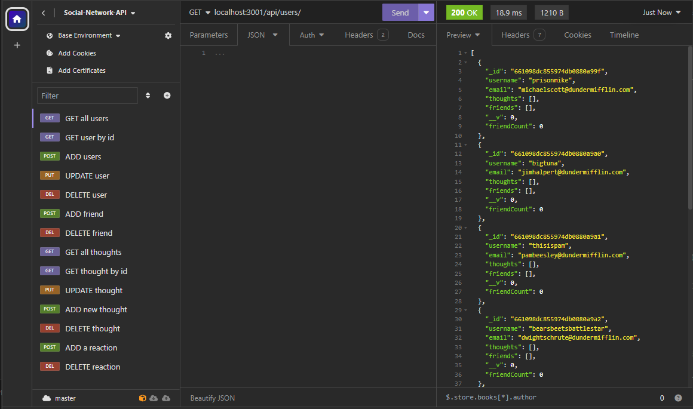

# Title: NoSQL Social Network API
  ## Table of Contents
  * [Description](#description)
  * [Installation](#installation)
  * [Usage](#usage)
  * [Contribute](#contributing)
  * [Questions](#questions) 
## Description: 
An API for a social network web application where users can share their thoughts, react to a friend's thoughts,  and create a friends list.
This API features `MongoDB` (a NoSQL database) with seeded data, `Express.js` for handling API routes, and `Mongoose ODM` to create our User and Thought/Reaction models.
Upon starting the server, we can then use [Insomnia](https://insomnia.rest/download) to make `GET`, `POST`, `PUT`, and `DELETE` requests which allow us to view, create, edit, and delete users, thoughts, and reactions. 

In this [walkthrough video](https://drive.google.com/file/d/1w18IRo8NiMAN3eMSQqwUz6kttnTFVDMZ/view), I will demonstrate the API's functionality using Insomnia. 

## Screenshots of Application 
 

## Installation
  * [Node.js](https://nodejs.org/en). Use command "node -v" in the terminal to see if it is already installed on your computer
  * [MongoDB](https://www.mongodb.com/try/download/community)

## Usage
  * Clone the repository
  * In the root directory, open the terminal and use command `npm install` to install all packages and dependencies
  * Use command `npm start` to start the server
  * Open Insomnia to make HTTP requests as demonstrated in the walkthrough 

## Contributing
  Fork the repository and code away!

## Questions
Contact me with questions: 
- https://github.com/ccarroll929 
- ccarroll0528@gmail.com
